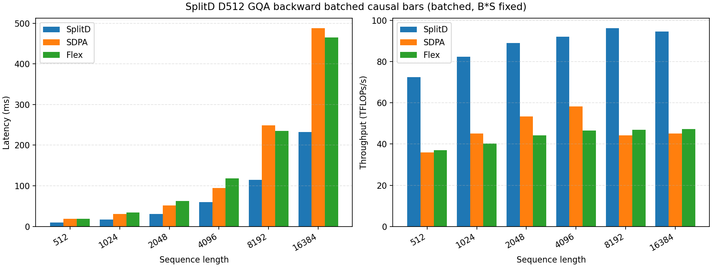
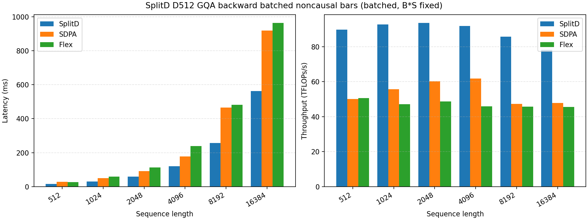
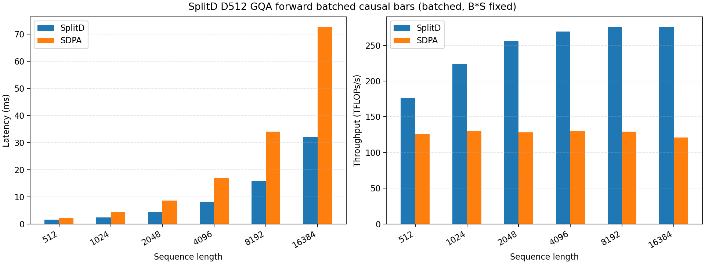
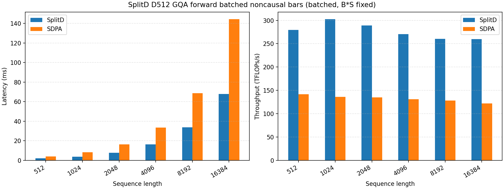

# gemm4-attention-kernels

`gemm4-attention-kernels` provides specialized SplitD FlashAttention kernels for the
`head_dim == head_dim_v == 512` GQA / global-attention path used by
[`google/gemma-4-31B-it`](https://huggingface.co/google/gemma-4-31B-it). The current
implementation targets NVIDIA Hopper / SM90 GPUs and is focused on large-head-dimension
training and benchmarking workloads rather than being a general replacement for every
FlashAttention configuration.

## Acknowledgements

This project deeply references and builds on the implementation ideas from the following
repositories:

- [`xlite-dev/ffpa-attn`](https://github.com/xlite-dev/ffpa-attn)
- [`Dao-AILab/flash-attention`](https://github.com/dao-ailab/flash-attention)

We also appreciate the related upstream work and discussion captured in:

- [`Dao-AILab/flash-attention#2412`](https://github.com/Dao-AILab/flash-attention/pull/2412/)
- [`Dao-AILab/flash-attention#2427`](https://github.com/Dao-AILab/flash-attention/issues/2427)

## Implementation Notes

This project is based on the CuTeDSL Python implementation of FlashAttention for Hopper
from [`Dao-AILab/flash-attention`](https://github.com/Dao-AILab/flash-attention),
especially the upstream `flash_attn/cute` code path. The D=512 SplitD implementation is
centered around these kernel files:

- `splitd-flash-attn/src/flash_fwd_sm90_d512.py` for the SM90 forward kernel.
- `splitd-flash-attn/src/fmha_dkdv_sm90_d512.py` for the backward dK/dV kernel.
- `splitd-flash-attn/src/fmha_dq_sm90_d512.py` for the backward dQ kernel.

The other CuTeDSL helper modules in `splitd-flash-attn/src` are copied from, or trimmed
from, the upstream
[`flash_attn/cute`](https://github.com/Dao-AILab/flash-attention/tree/main/flash_attn/cute)
implementation. This keeps the local interface close to the original FlashAttention
feature model while specializing the kernel selection to the D=512 SplitD path.

## Interface Coverage

The public interface follows the FlashAttention-style `q, k, v` API and supports MHA,
GQA, and MQA as long as the number of query heads is divisible by the number of KV heads.
Thanks to the retained upstream interface machinery, the current interface supports both
regular batched tensors and variable-length packed tensors through `cu_seqlens_q` /
`cu_seqlens_k`, and it supports causal masking through `causal=True`.

## Usage

Install the package from the `splitd-flash-attn` subdirectory, then import the public
interfaces from `splitd_flash_attn.interface`:

```bash
pip install -e /path/to/gemm4-attention-kernels/splitd-flash-attn
```

```python
from splitd_flash_attn.interface import (
    split_flash_attn_func,
    split_flash_attn_varlen_func,
)
```

Both entrypoints require CUDA tensors on Hopper / SM90, with
`head_dim == head_dim_v == 512`. Inputs use `(batch, seqlen, heads, dim)` layout for the
fixed-length API and `(total_tokens, heads, dim)` layout for the variable-length API.
Forward supports `torch.float16` and `torch.bfloat16`; training/backward currently
supports `torch.bfloat16`.

Example:

```python
from splitd_flash_attn.interface import (
    split_flash_attn_func,
    split_flash_attn_varlen_func,
)

# Fixed-length batched attention
out, lse = split_flash_attn_func(
    q, k, v, softmax_scale=scale, causal=False, return_lse=True,
)

# Variable-length packed attention
out, lse = split_flash_attn_varlen_func(
    q, k, v, cu_seqlens_q=cu_q, cu_seqlens_k=cu_k,
    max_seqlen_q=max_q, max_seqlen_k=max_k,
    softmax_scale=scale, causal=False, return_lse=True,
)
```

Notes:

- `num_heads_q` must be divisible by `num_heads_kv`; this covers MHA, GQA, and MQA.
- If `return_lse=False`, the public functions return only `out`; use `return_lse=True`
  when unpacking `(out, lse)`.
- `softcap`, local/window attention, `score_mod`, and auxiliary tensors are not supported
  on the current backward path.
- Only the `split_flash_attn_*` public names are exported.

## Performance Benchmarks

The benchmark plots below are generated from the D=512 GQA benchmark suite in
`splitd-flash-attn/scripts/bench_splitd_512_gqa_bs16k.py`. The plotted batched cases use
BF16 inputs with `Hq=32`, `Hkv=4`, `head_dim=512`, and a fixed total token count
(`B * S = 16384`) while sweeping the sequence length.

Across both forward and backward, and for both `causal=True` and `causal=False`, the
current SplitD implementation is significantly faster than the available PyTorch SDPA and
FlexAttention baselines for this D=512 GQA workload. The forward plots compare SplitD
against SDPA, while the backward plots include both SDPA and FlexAttention.









These results are still below the expected ceiling for an ideal SM90 FlashAttention
kernel. The main limitation is Hopper register pressure at `head_dim=512`: the current
kernel uses only one warp-group as the MMA consumer, which constrains the usual
online-softmax-centered warp-specialized pipeline design on SM90. The CTA-local SplitD
decomposition also breaks up what would otherwise be larger and more efficient G2S copies
and WGMMA instructions on Hopper. As a result, the current forward kernel sustains roughly
270 TFLOP/s on long-sequence cases, while backward is around 100 TFLOP/s.
